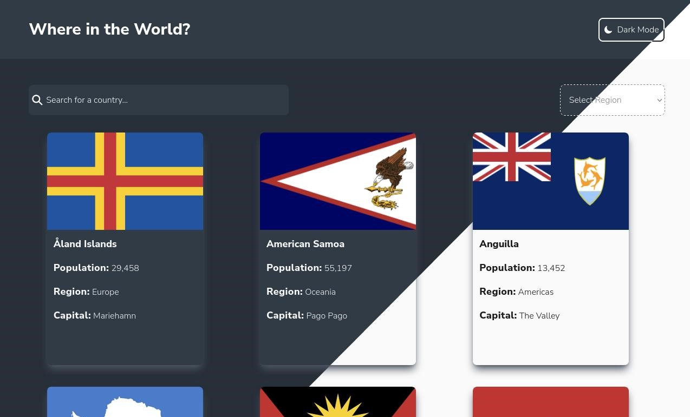
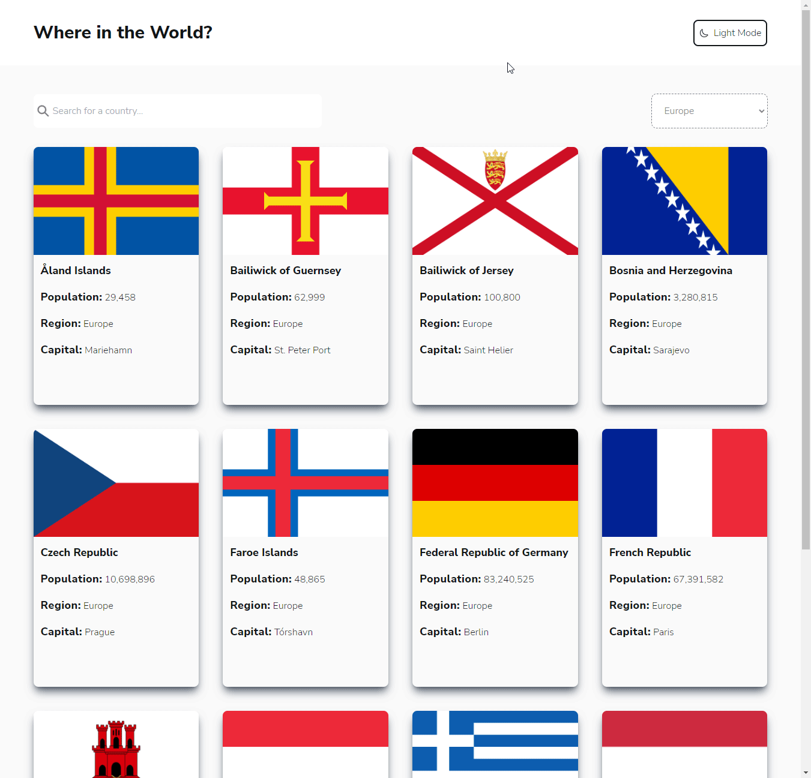

# REST Countries API - TypeScript Version

This is an app that I rebuilt with TypeScript. You can see the [JS version](https://github.com/victoriacheng15/fem-rest-countries-api#readme).

An app contains `search` and `dropdown` features where users can use a search box to search the desired country and use the dropdown to filter countries by regions (Africa, Americas, Asia, Europe, and Oceania). The users also can click a country to view more detailed information.

The user should be able to:

- [x] See all countries from the API on the homepage with pagination
- [x] Search for a country using an `input` field
- [x] Filter countries by region
- [x] Click on a country to see more detailed information on a separate page
- [x] Click through to the border countries on the detail page
- [x] Toggle the color scheme between light and dark mode

[View the site live here](https://rest-countries-api-ts-vc.netlify.app/)

## Tech stack:

     

## Screenshots/GIFs

Filter by Region Demo

Theme Switch Demo

Pagination Demo

## What I learned

**TypeScript**

- Learned about 4 ways to assign types in TypeScript: `interface`, `type`, `enum`, and `as`.
- Discovered that as is not a common way to assign types in TypeScript.
- Encountered a tricky aspect of type checking for the API because the API may have several levels of nested objects.
- Learned how to use `mapped types` to assign types to nested objects.
- Created several TypeScript interfaces to define the structure of data used in the project.
- Used a TypeScript context to provide and consume data across the project.

**useReducer**

- Learned how to use useReducer hook to bundle all state updates into one function with one hook.
- Recognized that useReducer can be beneficial for larger state updates with multiple actions.

**useMemo**

- Learned how to use the useMemo hook to cache the result of a calculation between re-renders.
- Discovered that useMemo can be used to optimize the performance of an app.

Additionally, I wrote blogs on `useReducer` and `useMemo` hooks to improve my understanding of both:

- [React Hooks - useReducer](https://victoriacheng15.vercel.app/blog/react-hooks-usereducer)
- [React Hooks - useMemo](https://victoriacheng15.vercel.app/blog/react-hooks-useMemo)

### Continued development

I am looking to add React Testing Library for this project to solidify my knowledge of Test-Driven Development.

### Resources

- [useMemo hook](https://beta.reactjs.org/apis/react/useMemo)
- [useCallback hook](https://beta.reactjs.org/apis/react/useCallback)
- [React TypeScript cheatsheet](https://react-typescript-cheatsheet.netlify.app/docs/basic/getting-started/context)

